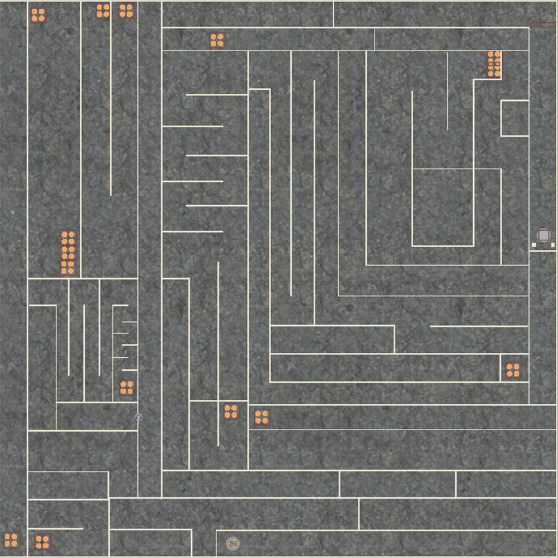
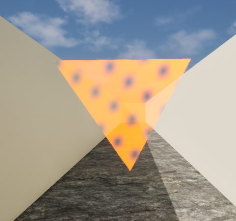
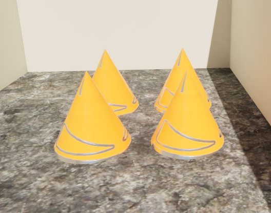
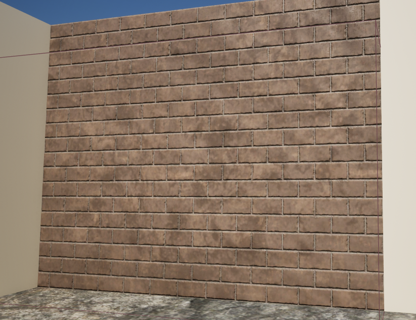
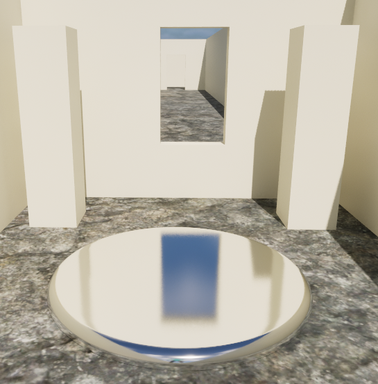
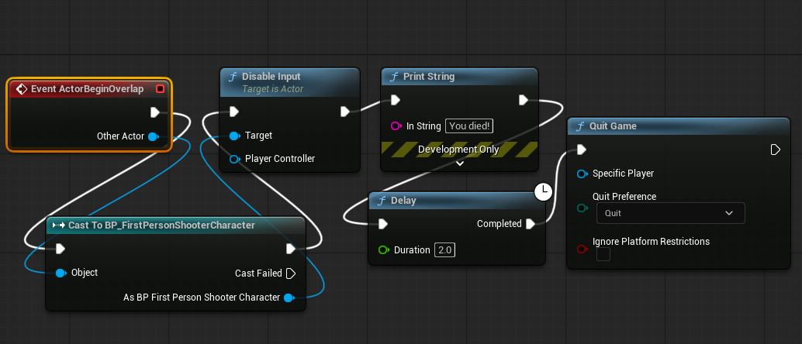
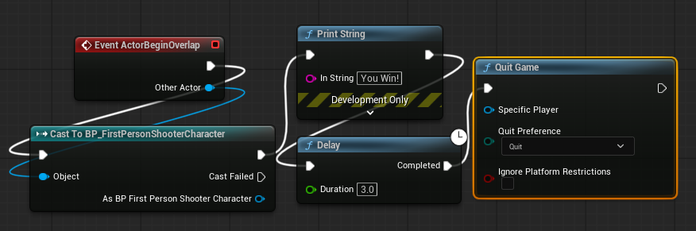
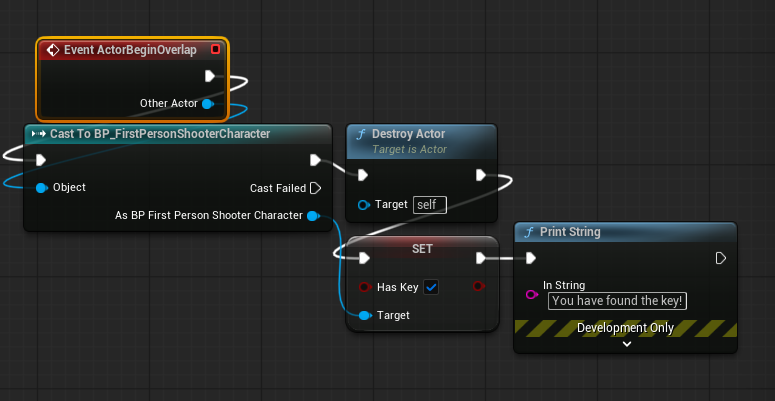
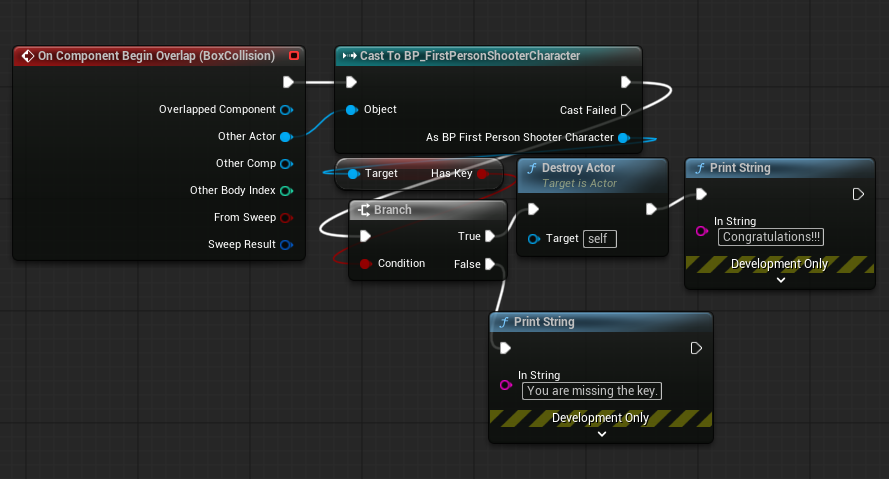
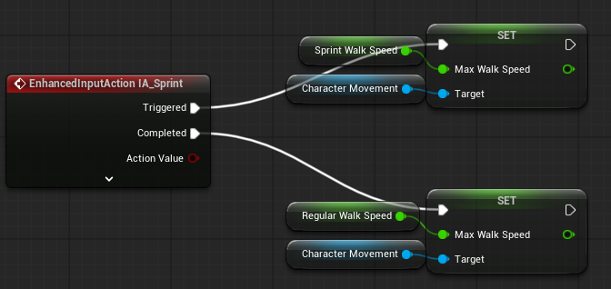

# Solve the Maze
This is a basic maze that the player will need to navigate in order to get to the end and win. Along the way there is a key hidden that will allow the player to unlock the final door to success. There are numerous spike traps in the level to end the game. The game will also end when the player reaches the final marker.

# Concept Image

Heavily inspired by The Talos Principle

## Intention
* Give the player a maze to traverse
* Display the key and door to make them obvious
* Include spike traps to impede the player

## Objects

### Deisgn
A relatively simple map made complicated by the lack of a minimap.

### Key
* Upside down pyramid
* Glows orange
* Floating above a platform
* Rotates slowly to indicate importance

### Spikes
* Yellow
* Cone shaped to indicate pointiness
* Sets of four
* Seemingly emerging from the ground
* Instant death

### Locked Door
* Brick
* Will warn player on approach
* Disappears if player possesses the key

### End Platform
* Silver
* On the ground
* Will congratulate player on contact

## Blueprints
### Spikes
* The spikes are designed to end the game. Initially the program immediately ended. While technically not a bug, it could lead to confusion among playtesters as they would be booted out of the session without warning. A string would be printed, informing a tester that the game was won. This led to:
* The message was immediate but so was application termination. A 2 second delay was introduced to allow the player to actually see the message. This in turn led to:
* The player could still move in these seconds. This was resolved by adding a Disable Input node to the blueprint.

### End platform
* This was designed to give the player a clear indication that this was an important object.
* Like the spikes, the player was immediately booted from the session on contact. This was resolved by introducing a string and delay, similar to the spikes.

### Key
* This was designed to be noticable and attractive to the player.
* The object will self destruct on contact with the player.
* The variable 'haskey' on the player will be set to true on contact.

### Door
* The door will allow the player to pass if the 'haskey' boolean is set to true.
* The door will self destruct in the process.
* There is a check in the blueprint. There will be a notification depending on whether the boolean 'haskey' is true or false.

### Sprint
There is a simple sprint mechanic:
* Hold shift to sprint
* Release shift to return to normal

(Blueprints have been reordered for ease of screenshots)

## Challenges
* Player can easily get lost
* Looping paths
* Spikes
* No indication of objective destination
* High walls make visibility poor

## Future Inclusions
* An arrow that points at destination depending on if the player attained the key
* A hard time limit
* A minimap
* Music
* Initial indication that the player needs a key
* Other potential hazards (lava, acid, pitfalls etc.)
* Stamina mechanic