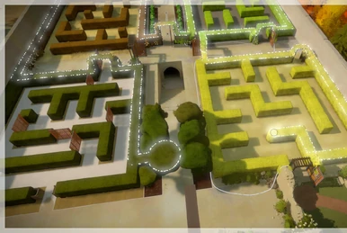

# Solve the Maze
This is a basic maze that the player will need to navigate in order to get to the end and win. Along the way there is a key hidden that will allow the player to unlock the final door to success. There are numerous spike traps in the level to end the game. The game will also end when the player reaches the final marker.

# Concept Image

Heavily inspired by The Talos Principle

## Intention
* Give the player a maze to traverse
* Display the key and door to make them obvious
* Include spike traps to impede the player

### Key
* Upside down pyramid
* Glows orange
* Floating above a platform
* Rotates slowly to indicate importance

### Spikes
* Yellow
* Cone shaped to indicate pointiness
* Sets of four
* Seemingly emerging from the ground
* Instant death

### Locked Door
* Brick
* Will warn player on approach
* Disappears if player possesses the key

### End Platform
* Silver
* On the ground
* Will congratulate player on contact

## Challenges
* Player can easily get lost
* Looping paths
* Spikes
* No indication of objective destination
* High walls make visibility poor